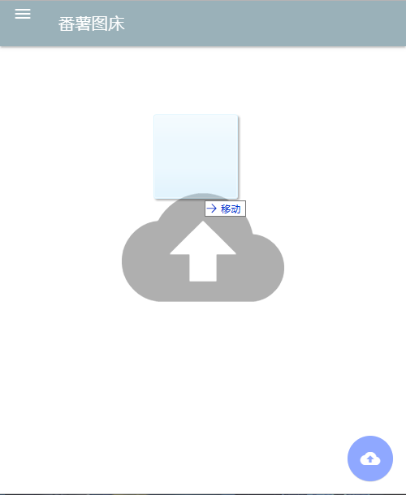

# Fanshu Image Host
这篇文档还有[中文版本](Readme_zh.md)
## What is Fanshu Image Host
Fanshu Image Host is a open source image hosting programme for websites and/or apps.
##  Deploy
Simply upload everything to your website and everything is done.
## Usage

 This is a preview of the website. Click the upload button to upload pictures.

 ... or drag in pictures to upload.

 Notification will be sent to you once uploading starts/ends. Images will be displayed once it is uploaded.

 Click on the image to copy its url.

 Click on the <b style="background-color:red">&nbsp;X&nbsp;</b> button to remove the file from your browser(but not from the server).

## Todo List
- [x] Organise files according to date
- [x] Delete from server, not only from browser
- [ ] ~~Improve on compressing for png and gif~~
- [ ] Improve on UI
  - [x] ~~Right Click Menu~~
  - [x] ~~Display progress bar with image while uploading~~
  - [x] ~~Animations~~
  - [x] Select images

## Download
Download from the [releases](https://github.com/fanshucoders/image-host/releases) page.
## Demo
A demo of this application is available at http://fstc.hostfree.pw
