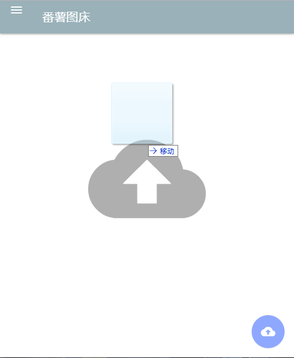
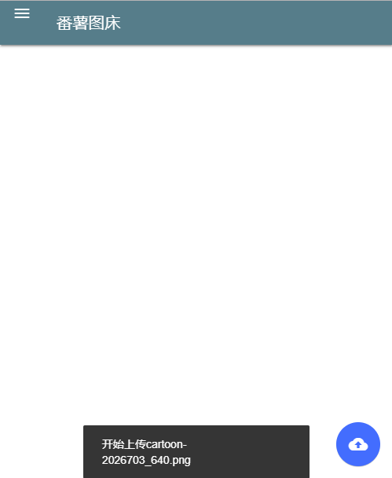
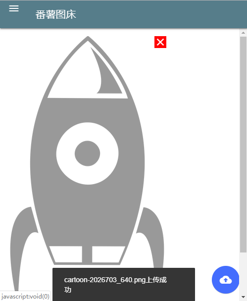

# 番薯图床
[English version](Readme.md) of this document is also available.
## 什么是番薯图床
番薯图床是一款开源的图床应用，为网站和应用提供图片外链。
##  使用
把所有文件上传到服务器即可。
## 制作链接

 点击上传按钮选择要上传的图片

 或者拖拽图片也可以上传

 在上传开始时会有底部消息通知，图片一旦上传完毕便会出现在页面内

 点击图片复制链接

 点击 <b style="background-color:red">&nbsp;X&nbsp;</b> 从浏览器中删除图片(不会从服务器删除)
## Todo List
- [ ] 按日期对文件分类
- [ ] 上传时在图片上展示进度条
- [ ] 不仅从浏览器删除，也可以从服务器删除
- [ ] 改善对png和gif图片的压缩
- [x] 右键菜单

## 下载
从 [releases](https://github.com/fanshucoders/image-host/releases) 下载
## Demo
Demo 网址: http://fstc.hostfree.pw
